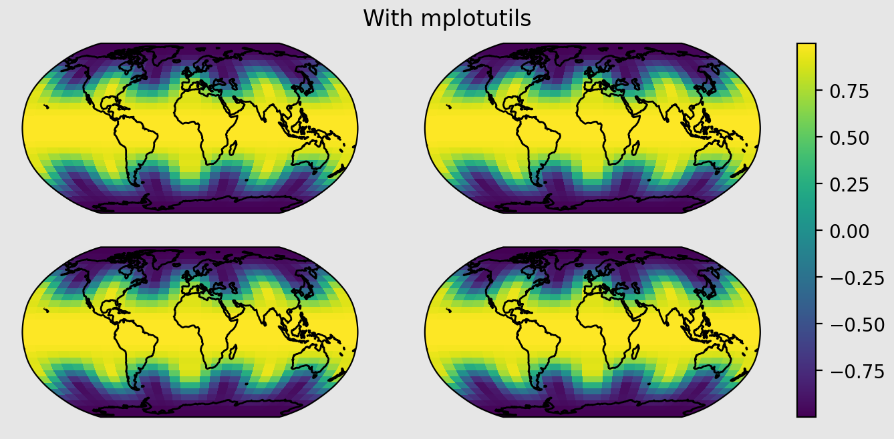

# mplotutils

> *helper functions for cartopy and matplotlib*

## fix layout for cartopy axes and colorbars

This package solves two main problems for plots with maps created with cartopy. Because these plots have a fixed aspect ratio (1) colorbars will extend beyond the visible axes and (2) the distance between individual subplots will seemingly be random.

**subplots**

Without mplotutils         |  With mplotutils
:-------------------------:|:-------------------------:
 | 

The code to create the examples can be found in [docs/example.py](docs/example.py).

**axes_grid**

Matplotlib's [axes_grid](https://matplotlib.org/stable/users/explain/toolkits/axes_grid.html) can also display data with a fixed aspect ratio. However, the size of the figure will not be correct. mplotutils (from version 0.6) can also help with this

| Axes grid - without mplotutils     | Axes grid - with mplotutils |
| :--------------------------------: | :-------------------------: |
|  |  |

The code to create the example can be found in [docs/example_axes_grid.py](docs/example_axes_grid.py).

## hatching

mplotutils (from version 0.6) includes helper functions to draw hatches and add stippling:

The code to create the example can be found in [docs/example_hatch.py](docs/example_hatch.py).

## Installation

See [docs/installation.md](docs/installation.md).

## Changelog

See [CHANGELOG.md](CHANGELOG.md).

## History

This package bases on functions developed for the [python visualisation workshop at C2SM](https://github.com/C2SM/pyvis/).
